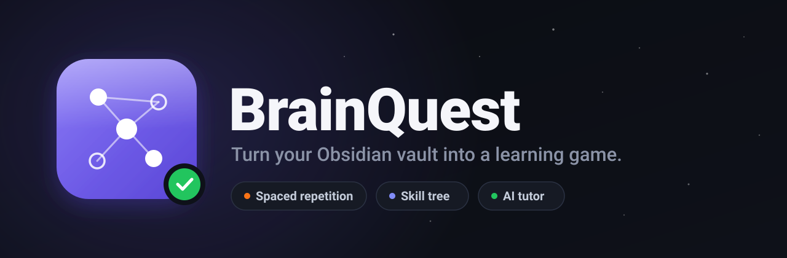
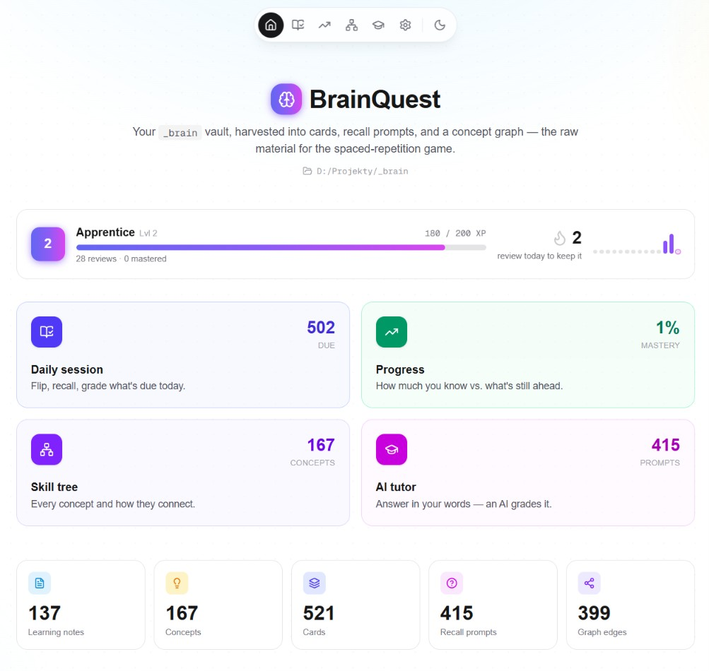
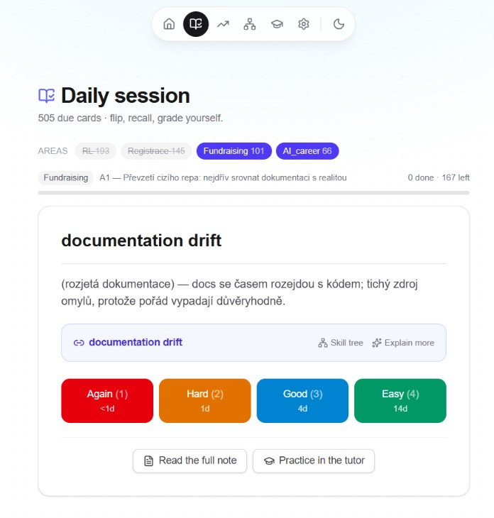
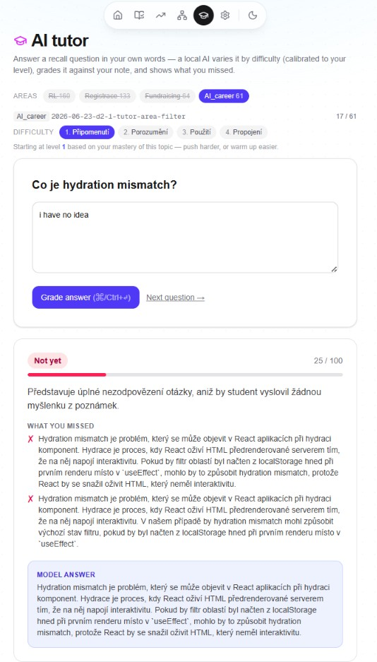
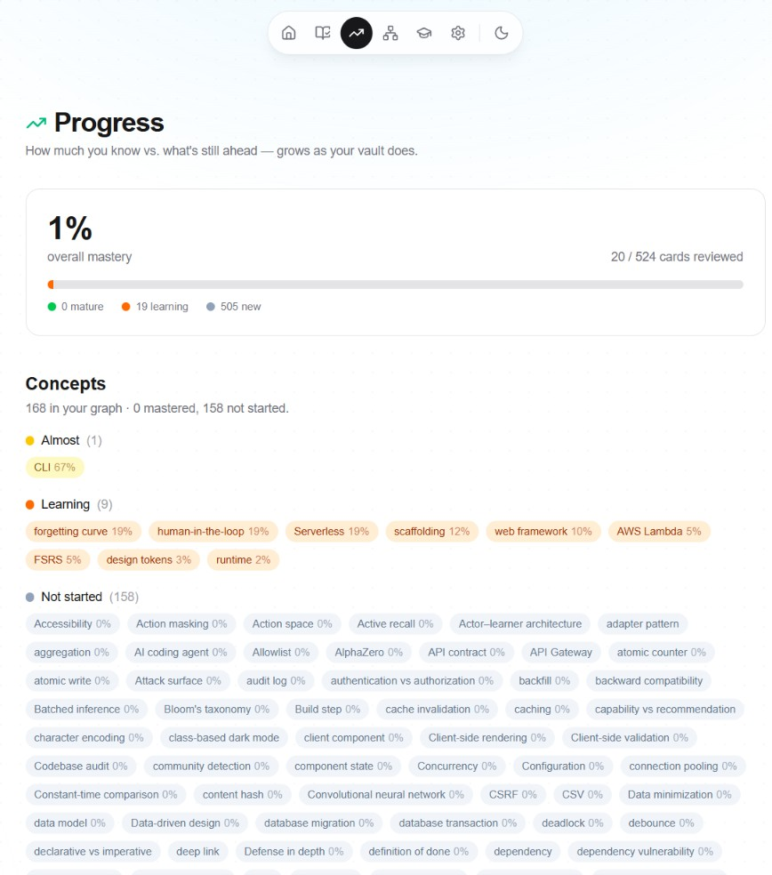
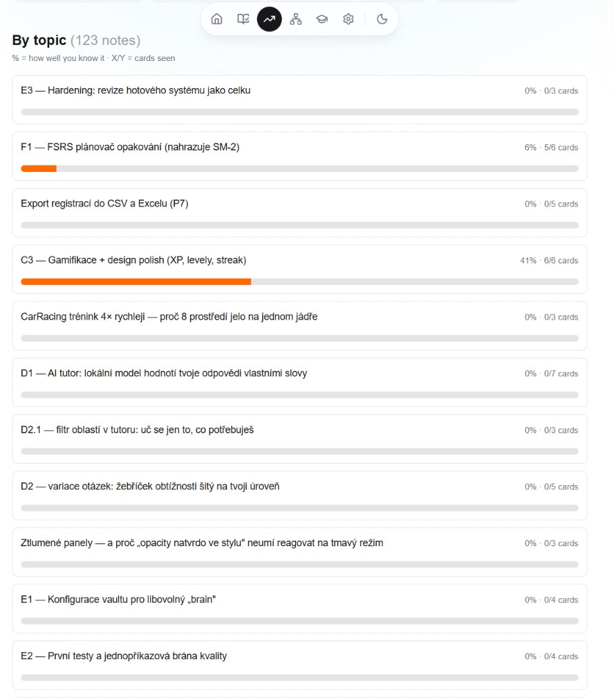
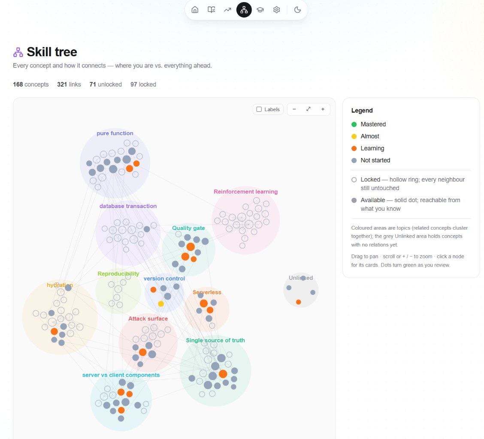
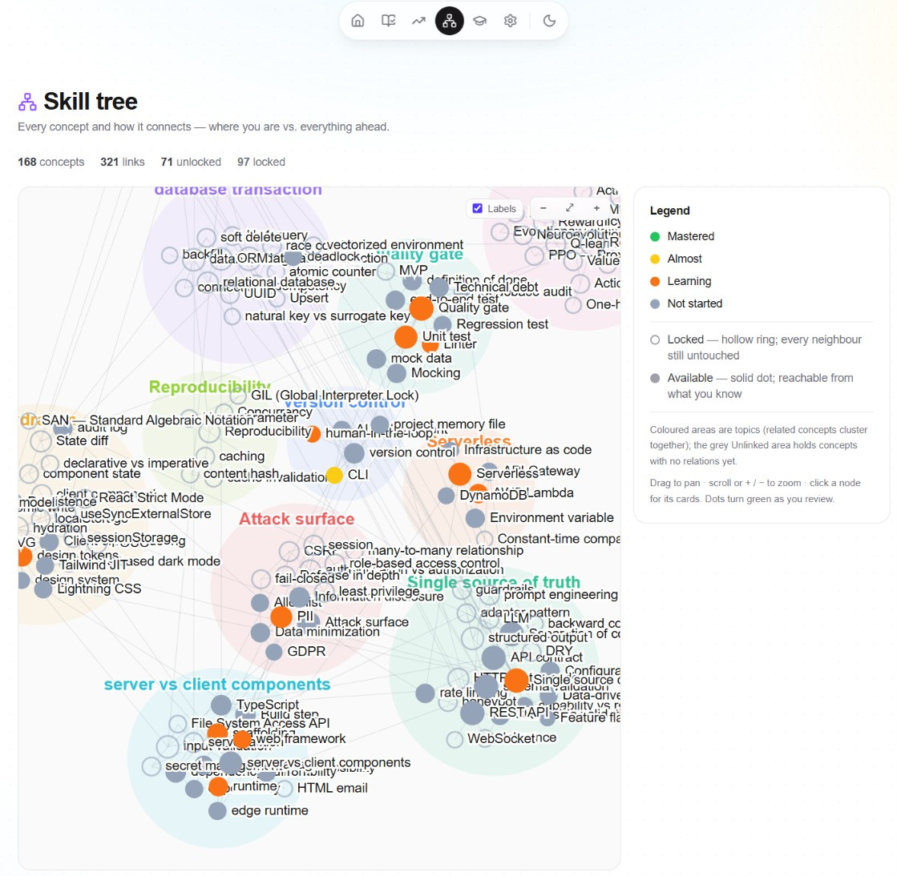
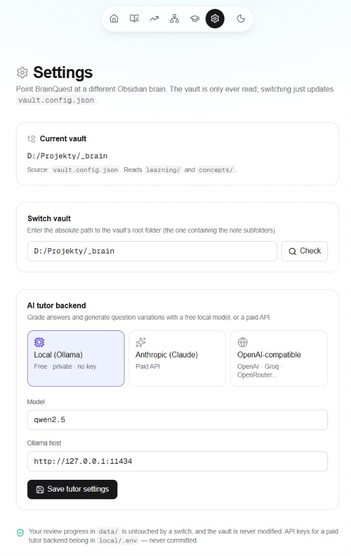

<p align="center">
  
</p>

# BrainQuest

Turn an Obsidian knowledge vault into an active learning game — **spaced repetition + a skill-tree of
concepts + an AI tutor** — so you actually *absorb* what you've written down, not just store it.

Designed and directed by Martin, built with an AI coding agent — a from-scratch Next.js app that
reads a cross-project "second brain" vault **read-only** and turns its dated learning notes and atomic concept
notes into scheduled flashcards, recall prompts, and a visual mastery map.

> Status: **feature-complete, hardened (Phase A → F1 + the E3 security/robustness pass).** Live: the vault reader,
> harvested cards + concept graph, an **FSRS** spaced-repetition scheduler, a daily session, a mastery model, a visual
> skill tree, gamification, and the LLM tutor. Build plan + design live in `docs/` and the private
> `local/` working area.

## Screenshots

> **A note on language.** The whole **interface is in English**. The *content* you see inside the cards, notes, and
> tutor answers is harvested from the author's own Obsidian vault, which is written in **Czech** — so concept glosses,
> note titles, and the tutor's feedback appear in Czech. That's the author's study material, not a UI setting: point
> BrainQuest at an English vault and those parts are English too. The AI tutor also deliberately answers in the
> learner's own language to help them build the vocabulary. Each caption below translates the key Czech parts.

| | |
|---|---|
| **Home** — vault harvested into cards, recall prompts, and a concept graph, with your level, XP, and streak. |  |
| **Daily session** — flip a card, recall it, grade yourself (Again / Hard / Good / Easy); every card opens a "go deeper" block with a **Skill tree** jump and an on-demand AI **Explain more**, plus links to the full note and the tutor. *(Card shown: "strict mode / type safety", concept "TypeScript"; the Czech gloss + the expanded "Explain more" elaborate on it.)* |  |
| **AI tutor** — answer a recall question in your own words; a local (or hosted) LLM grades it against your note and shows what you missed. The difficulty rungs are a **Recall → Understand → Apply → Analyze** ladder. *(Question shown: "Co je oddělení designu od implementace?" = "What is separating design from implementation?"; the grading feedback is in Czech.)* |  |
| **Progress** — overall mastery (mature / learning / new), plus every concept bucketed by how well you know it. |  |
| **Progress by topic** — a per-note bar (% known · cards seen). *(The note titles are Czech — they're the author's learning notes, e.g. "F1 — FSRS plánovač opakování" = "F1 — the FSRS review scheduler".)* |  |
| **Skill tree** — every concept as a node, clustered into colour-coded topics; hollow = locked, solid = reachable, and dots turn green as you master them. |  |
| **Skill tree (labels on)** — the same map with concept labels shown. |  |
| **Settings** — point BrainQuest at a different vault (read-only), and choose the AI tutor backend: free local Ollama, or a paid Anthropic / OpenAI-compatible API. |  |

## What's inside
- **Skill tree + progress** — see how much you already know vs. everything still ahead (which grows as the
  vault grows). Concepts unlock along a dependency-ordered path.
- **Daily session** — a short spaced-repetition review (FSRS) of what's due today. Each card is a **doorway to
  depth**: reveal it to see the concept's fuller definition, jump into the skill tree, get an on-demand AI "Explain
  more", read the full source note in-app, or steer the next card toward a related topic.
- **AI tutor** — grades your free-text recall answers and generates fresh question phrasings. Run it **free on a
  local LLM** (Ollama — no cloud, no key, fully private) **or point it at a paid hosted API** (e.g. Claude / OpenAI)
  when you want bigger models without local hardware. The LLM call sits behind one swappable transport, so it's your
  pick of cost vs. convenience. Optional either way — every other page works with no model at all.

## Stack
Next.js (App Router) + TypeScript + Tailwind, with [lucide](https://lucide.dev) icons. Review/progress state is
JSON under `data/` (kept per-device, gitignored). The vault stays read-only. The AI tutor talks to a local
[Ollama](https://ollama.com) server by default, or a paid hosted API. Unit tests run on [Vitest](https://vitest.dev).

## Run
```
npm install
npm run dev            # http://localhost:3000
```
The vault path comes from `vault.config.json` (override per-machine with the `BRAINQUEST_VAULT_PATH` env var).
Pick the AI tutor backend on the **Settings page** (`/settings` → "AI tutor backend"):
- **Free, local, private** — [Ollama](https://ollama.com) with the configured model (defaults to `qwen2.5`).
  Nothing leaves your machine and there's no API key.
- **Paid hosted API** — **Anthropic (Claude)** or any **OpenAI-compatible** service (OpenAI, Groq, OpenRouter, Together,
  a local proxy — set its base URL). Larger models, no local hardware. Put the key in `local/.env` as
  `TUTOR_API_KEY=…` (never committed); the page shows whether a key was detected.

The provider/model/base-URL live in `vault.config.json` (`tutor` section) — only ever the non-secret bits. Without any
backend reachable, the rest of the app still works and the tutor shows a friendly "offline" message.

## Point at another vault
BrainQuest ships with an example `vault.config.json`, and it reads *how* to read a vault from that file —
so you can point it at any Obsidian brain by editing config, not code. No data migration: your review
progress in `data/` is untouched, and the vault itself is only ever read.

The quickest way is the in-app **Settings page** (`/settings`, reachable from the floating menu on every page): paste a
vault folder path, hit **Check** to validate it and preview what was found, then **Save & switch**. It writes the path
into `vault.config.json` for you. (A native OS folder-picker isn't possible — the browser can't hand a server-side app a
filesystem path — so it's an enter-and-validate flow.)

Or edit `vault.config.json` directly:
- `vaultPath` — the vault folder (or set the `BRAINQUEST_VAULT_PATH` env var per-machine, which wins).
- `folders` — the subfolders holding learning notes and concept notes.
- `harvest` — the section headings to harvest (cards, recall prompts, related-concepts list). Each may be a single
  heading or a **list of accepted aliases**, so English and other-language headings both work; the first is shown in the UI.
- `tags` — `hubPrefix` (the line naming a note's hub, e.g. `Belongs to:`; also accepts a list) and `projectTagPrefix`
  (e.g. `project/`).
- `areas` — friendly `labels` per project slug for the tutor's category filter, and `offByDefault` slugs hidden
  until you opt in.

Any section you omit falls back to the built-in defaults, so a minimal config still boots.

## Note format (what the app reads & links)
BrainQuest harvests plain Markdown — no special plugin. It reads two folders (names from `vault.config.json` →
`folders`): **learning notes** and **concept notes**. The default section headings are **English**, so a fresh brain
works out of the box; each `harvest` heading can also be a **list of accepted aliases**, so one vault may mix languages
and other-language headings (e.g. the Czech `📘 Nové pojmy`, with or without the emoji) harvest too. Anything outside
these patterns is ignored, so the format degrades gracefully.

### Learning note — `learning/YYYY-MM-DD-slug.md`
```markdown
# Forward migration & the FSRS store          ← first H1 = the note title

#learning #project/brainquest                 ← a tag line (starts with #); #project/<slug> sets the AREA
Belongs to: [[BrainQuest]]                     ← hub link (prefix from tags.hubPrefix)

## 📘 New concepts                             ← cards section (harvest.cardsHeading; aliases accepted)
- **FSRS** (Free Spaced Repetition Scheduler) — a memory-model scheduler. → [[FSRS]]
- **stability** — days until recall drops to ~90%.
- _Template hint bullets in italics are skipped._

## ❓ To review next                           ← recall prompts (harvest.recallHeading) — used by the tutor
- Why does FSRS schedule better than SM-2?
- What do stability and difficulty each control?
```
- **Filename** — the leading `YYYY-MM-DD` sets the note's date; the daily session introduces **older notes first**
  (foundations before recent material).
- **Cards** — one per bullet under the cards heading: `- **term** (gloss) — definition → [[concept]]`. The **bold term**
  is the card front; the rest is the back; the optional `→ [[concept]]` links the card to a concept node. Bullets without
  a leading **bold** term, and italic (`- _…_`) helper bullets, are skipped.
- **Recall prompts** — each bullet under the recall heading becomes one free-text question in the AI tutor.

### Concept note — `concepts/Name.md`
```markdown
# FSRS                                         ← first H1 = concept title (and node label)

**FSRS** (Free Spaced Repetition Scheduler) — …  ← first bold line = the concept's gloss

## Related                                     ← related concepts (harvest.relatedHeading) = graph edges
- [[SM-2]] — the simpler predecessor it replaces
- [[forgetting curve]] — the curve it schedules against
```
- **Edges** — each `- [[Target]] — reason` bullet under the related heading becomes a skill-tree edge from this concept
  to `Target` (wikilinks resolve case-insensitively, like Obsidian).

## Quality gate
One command runs the whole gate — types, lint, unit tests, production build — and must be green before a commit:
```
npm run check          # tsc --noEmit  +  eslint  +  vitest run  +  next build
```
Individual steps: `npm run typecheck` · `npm run lint` · `npm test` · `npm run build`.

### Tests
Unit tests cover the **pure, risky logic** — the markdown parser, the FSRS scheduler, mastery/progress
aggregation, the gamification engine (XP/levels/streaks), the tutor's difficulty ladder + cache, and the
skill-tree lock derivation — colocated as `lib/**/*.test.ts`. They are deterministic (every clock and seed is
injected) and need no network, so the gate is reproducible.
```
npm test               # run once
npm run test:watch     # re-run on change
```
The tutor's **live** LLM round-trip is non-deterministic and needs a running Ollama, so it's intentionally not
unit-tested — it's exercised by hand in the tutor UI.

## Docs
- `docs/architecture.md` — how it works.

## Author & license
Built by Martin — [svobodamartin.dev](https://svobodamartin.dev). Released under the [MIT License](LICENSE).
